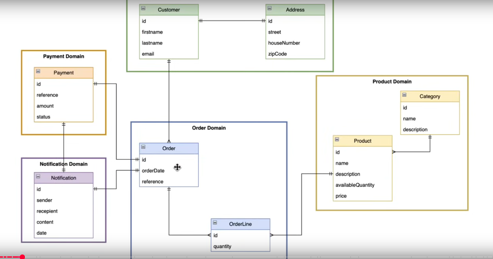
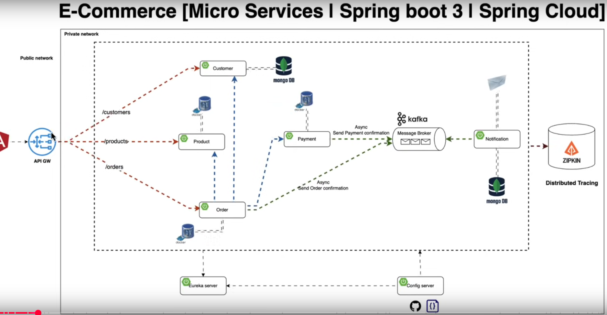

# Microservice with Springboot, Kafka, Keycloak

### Domain-Driven Design



### System-Architecture



Each service pulls its configuration from the config server and starts running by registering itself in the Eureka server. The api-gateway communicates with Eureka to know about the registered services.

### Implementation

1. create a docker compose file with all the services,networks and volumes

## Config-Server Implementation

1. Create config-server using `config server` dependency from spring-initializer

## Discovery-Service Implementation

1. Create discovery service with the following dependencies - 
 - config client ( for fetching configuration from configuration server)
 - eureka server (so that microservices can register themselves)

## Customer-Service Implementation

1. create a customer-service.yml file in the config server
2. pull the properties from the config server in the customer-service

There are couple of things to remember about mongo-db:

1. Our goal was to connect to the mongo-db using admin user and password and then create a customer database. The best way to do this is to create a init-mongo.js file and mount it as a volume in the docker-compose file. The init-mongo.js file will be executed when the mongo-db container is started. The init-mongo.js file should contain the following code:

```js
db = db.getSiblingDB("customer");  // create/use customer DB

db.createUser({
  user: "customer_user",
  pwd: "customer_pass",
  roles: [
    { role: "readWrite", db: "customer" }
  ]
});

```

now modify the docker-compose file to mount the init-mongo.js file as a volume:

```yml
services:
  mongodb:
    image: mongo:latest
    container_name: ms_mongo
    restart: unless-stopped
    environment:
      MONGO_INITDB_ROOT_USERNAME: mongo
      MONGO_INITDB_ROOT_PASSWORD: 123
      MONGO_INITDB_DATABASE: admin
    volumes:
      - ./mongo-init.js:/docker-entrypoint-initdb.d/mongo-init.js:ro
    ports:
      - 27017:27017

```

but for learning purpose, I connected to the mongo-db container and created the user and database manually.

## Product-Service Implementation

1. Connected with the container using intellij's Database tool
2. Created a database named product with username and password
3. created a product-service.yml file in the config server to connect to the product database
4. pulled the properties from the config server in the product-service

## Exception Handling

The following exception handling mechanism is implemented in both customer-service and product-service:

1. create a custom exception class that extends Runtime Exception, i.e. `EntityNotFoundException`
2. create a global exception handler class that uses `@RestControllerAdvice annotation`. Don't forget to handle `MethodArgumentNotValidException` for validation errors.